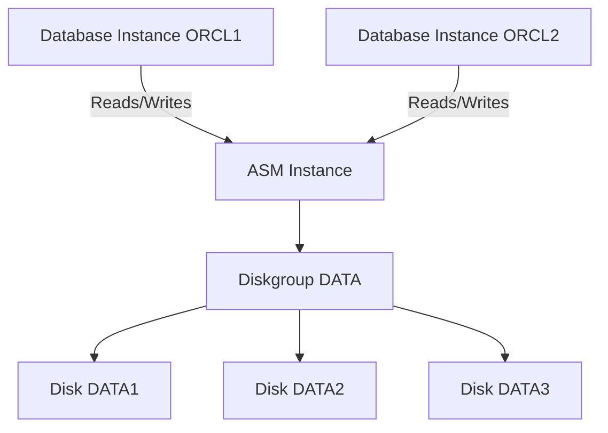
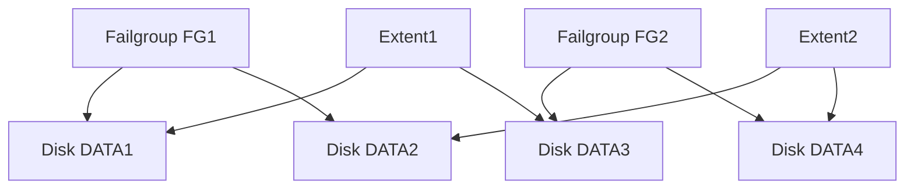
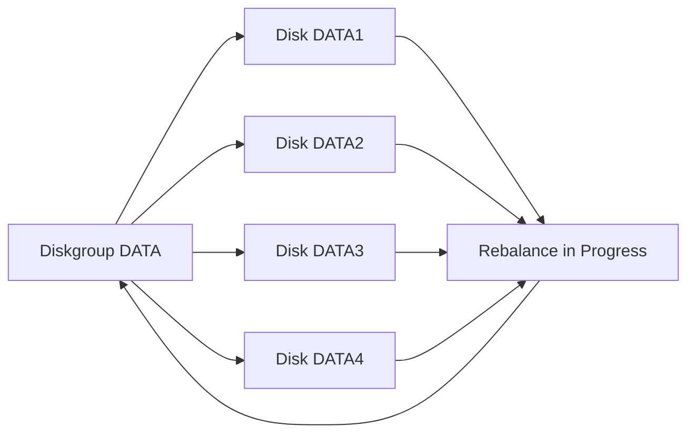
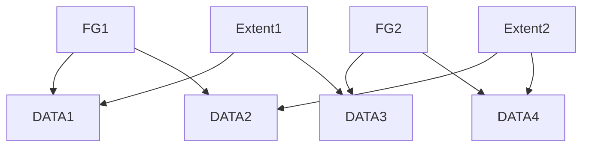
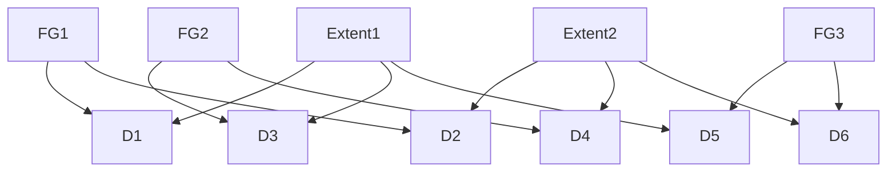

## Oracle 19c Grid Infrastructure & ASM – Complete Practical Guide 

This document is a **step-by-step practical guide** to **Oracle ASM (Automatic Storage Management)** in **Oracle Grid Infrastructure 19c**, including **disk preparation, ASMCA, ASMCMD, SQL diskgroup operations, adding/dropping disks, rebalancing, and Failure Groups**.

---

## 1. 🔑 ASM Architecture

📘 **Definition**
ASM is a **volume manager + filesystem** for Oracle databases.

* ASM instance manages **diskgroups**.
* Database instances read/write to ASM diskgroups through ASM library driver.

💻 **Mermaid Diagram**



---

## 2. 🔧 Logging in to ASM Instance

⚠️ **Pre-requisites**

* ASM instance running.
* OS user `grid` exists.
* User has `SYSASM` privileges.

💻 **Commands**

```bash
su - grid
sqlplus / as sysasm
```

---

## 3. ⚠️ Preparing Disks for ASM

⚠️ **Pre-requisites**

* Identify new raw disks.
* Disks **not members** of existing diskgroups.
* Disks **Candidate or Provisioned**.
* ASM instance running.

💻 **Commands**

```bash
fdisk -l | grep sd
lsblk
oracleasm listdisks
sqlplus / as sysasm
SET LINES 200
COL PATH FORMAT A30
COL HEADER_STATUS FORMAT A15
SELECT PATH, HEADER_STATUS, NAME AS DISKGROUP_NAME FROM V$ASM_DISK;
oracleasm createdisk DISK1 /dev/sdb
oracleasm createdisk DISK2 /dev/sdc
oracleasm listdisks
```

---

## 4. 📦 Creating a Diskgroup

⚠️ **Pre-requisites**

* ASM ONLINE.
* Candidate/Provisioned disks available.
* Disks not in other diskgroups.
* Decide on redundancy (External, Normal, High).

💻 **Commands**

```sql
SET LINES 200
COL PATH FORMAT A30
COL HEADER_STATUS FORMAT A15
SELECT PATH, HEADER_STATUS, TOTAL_MB, FREE_MB
FROM V$ASM_DISK
WHERE HEADER_STATUS IN ('CANDIDATE','PROVISIONED');

CREATE DISKGROUP DATA EXTERNAL REDUNDANCY
DISK '/dev/oracleasm/disks/DISK1' NAME DATA1,
     '/dev/oracleasm/disks/DISK2' NAME DATA2;

SELECT NAME, TYPE, STATE, TOTAL_MB, FREE_MB FROM V$ASM_DISKGROUP;
```

---

## 5. 🛡️ Diskgroup with Failure Groups

⚠️ **Pre-requisites**

* ASM ONLINE.
* Candidate/Provisioned disks available.
* Redundancy = Normal or High.
* Assign disks to **Failure Groups** based on physical layout.

💻 **Commands**

```sql
CREATE DISKGROUP DATA NORMAL REDUNDANCY
FAILGROUP FG1 DISK '/dev/oracleasm/disks/DISK1' NAME DATA1,
              '/dev/oracleasm/disks/DISK2' NAME DATA2
FAILGROUP FG2 DISK '/dev/oracleasm/disks/DISK3' NAME DATA3,
              '/dev/oracleasm/disks/DISK4' NAME DATA4;

SELECT GROUP_NUMBER, NAME AS DISKGROUP_NAME, TYPE, STATE, TOTAL_MB, FREE_MB FROM V$ASM_DISKGROUP;
SELECT PATH, NAME AS DISK_NAME, FAILGROUP, HEADER_STATUS, STATE FROM V$ASM_DISK;
```

💻 **Mermaid Diagram – Failure Groups**



---

## 6. ➕ Adding Disks to Diskgroup / Failure Group

⚠️ **Pre-requisites**

* Diskgroup ONLINE.
* Disk Candidate/Provisioned.
* Assign to proper FG.

💻 **Commands**

```sql
ALTER DISKGROUP DATA ADD DISK '/dev/oracleasm/disks/DISK5' NAME DATA5 FAILGROUP FG1;
SELECT PATH, NAME AS DISK_NAME, FAILGROUP, HEADER_STATUS, STATE FROM V$ASM_DISK;
```

---

## 7. ➖ Dropping Disks from Diskgroup / Failure Group

⚠️ **Pre-requisites**

* Diskgroup ONLINE.
* Disk safe to remove.
* Remaining disks maintain redundancy.

💻 **Commands**

```sql
ALTER DISKGROUP DATA DROP DISK DATA2;
SELECT PATH, NAME AS DISK_NAME, FAILGROUP, HEADER_STATUS, STATE FROM V$ASM_DISK;
```

---

## 8. ⚖️ Rebalancing Diskgroup / FGs

⚠️ **Pre-requisites**

* Diskgroup ONLINE.
* No conflicting operations.

💻 **Commands**

```sql
ALTER DISKGROUP DATA REBALANCE POWER 5;
SELECT GROUP_NUMBER, OPERATION, STATE, POWER, SOFAR, EST_MINUTES FROM V$ASM_OPERATION;
ALTER DISKGROUP DATA REBALANCE CANCEL;
```

💻 **Mermaid Diagram – Rebalance Workflow**



---

## 9. Normal vs High Redundancy – Extent Placement Across FGs

💻 **Mermaid Diagram – Normal Redundancy**



💻 **Mermaid Diagram – High Redundancy**



---

## 10. 🐚 ASMCMD – Practical CLI Usage

⚠️ **Pre-requisites**

* ASM ONLINE.
* Diskgroup exists.

💻 **Commands**

```bash
asmcmd -p
lsdg
lsdsk
cd DATA
ls
du
mkdir arch
touch arch/file1.dbf
cp arch/file1.dbf arch/file2.dbf
mv arch/file2.dbf arch/file2_old.dbf
rm arch/file1.dbf
sp DATA
exit
```

---

## 11. 📊 ASM Monitoring Views

💻 **Commands**

```sql
SET LINES 200
COL NAME FORMAT A15
COL TYPE FORMAT A10
COL STATE FORMAT A10
SELECT NAME, TYPE, STATE, TOTAL_MB, FREE_MB FROM V$ASM_DISKGROUP;

COL PATH FORMAT A30
COL HEADER_STATUS FORMAT A15
SELECT NAME AS DISK_NAME, PATH, FAILGROUP, HEADER_STATUS, STATE FROM V$ASM_DISK;

SELECT INSTANCE_NAME, DB_NAME, STATUS FROM V$ASM_CLIENT;
SELECT GROUP_NUMBER, OPERATION, STATE, POWER, SOFAR, EST_MINUTES FROM V$ASM_OPERATION;
```

---

## 12. 🚀 Complete Practical Sequence Summary

1. Prepare disks (identify, check status, register).
2. Verify Candidate/Provisioned disks.
3. Create diskgroup (ASMCA / SQL).
4. Assign disks to Failure Groups if redundancy > External.
5. Add disks to diskgroup / FGs.
6. Drop disks from diskgroup / FGs.
7. Rebalance diskgroup / FGs if needed.
8. Navigate ASM files/disks via ASMCMD.
9. Monitor diskgroup, disks, FGs, and rebalance via views.
10. Understand Normal/High redundancy extent placement across FGs.

---


Do you want me to do that next?
